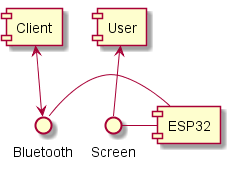
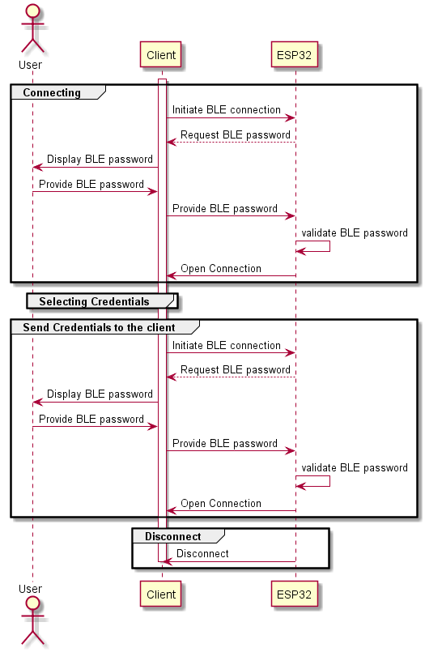

# espwv32
A password vault you can take with you.

## Key Properties
* No client software needed
* 2 factor authentication
* Encrypted storage
* Secure communication

### Current status
* [x] BLE connection requires passcode
* [ ] Secure BLE connection
* [x] Send username and password on button push
* [ ] Store credentials securely on the device

## High Level Acrchitecture

## Sequences

## Hardware
https://m5stack.com/products/stick-c
https://docs.m5stack.com/#/en/arduino/arduino_api

## Inspiring reads:
* https://github.com/espressif/arduino-esp32/blob/master/tools/sdk/include/mbedtls/mbedtls/aes.h
* https://hackaday.com/2020/02/19/password-keeper-uses-off-the-shelf-formfactor/
