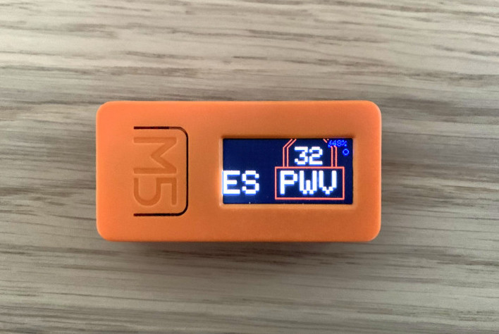
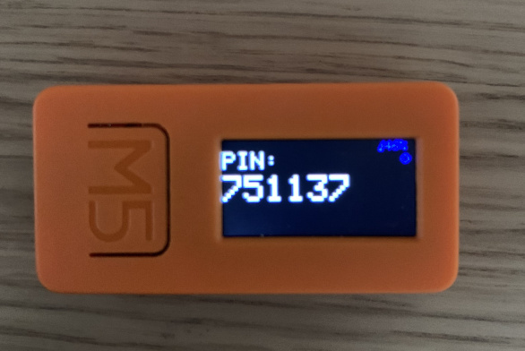
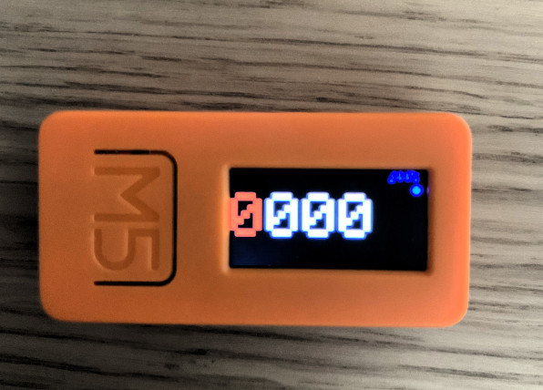
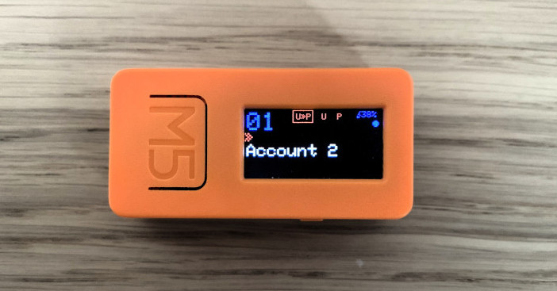
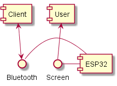
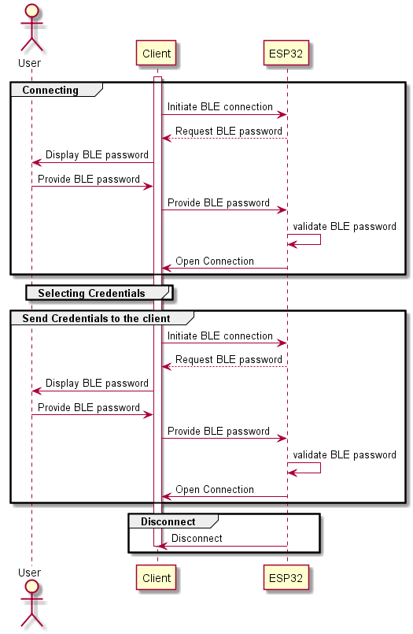

# espwv32
A password vault you can take with you. Credentials are stored encrypted on the device and sent wirelessly to a connected computer via Bluetooth HID (acts as a keyboard).

## Key Properties
* No client software needed — appears as a Bluetooth keyboard
* 2-factor authentication — BLE pairing PIN + user-defined device PIN
* AES-256 encrypted credential storage
* Secure BLE connection (MITM-protected bonding)
* Web-based account management via on-device Wi-Fi access point

### Current status
* [x] BLE connection requires passcode
* [x] Secure BLE connection
* [x] Send username and password on button push
* [x] Store credentials securely on the device
* [x] Manual managing accounts (via Wi-Fi Admin screen)
* [ ] Proposing new passwords for existing accounts
* [ ] Changing a password manually
* [ ] Fully security checked

---

## Hardware
* Device: https://m5stack.com/products/stick-c
* Arduino API: https://docs.m5stack.com/#/en/arduino/arduino_api
* **Button A** — the main side button (larger)
* **Button B** — the front button (smaller, below the screen)

---

## Screen Flow

```
┌─────────────┐   BLE pair     ┌────────────┐   BLE auth OK   ┌────────────┐
│ Start Screen│ ─────────────► │ Pin Screen │ ───────────────► │ Lock Screen│
└─────────────┘                └────────────┘                  └────────────┘
                                                                      │
                                                              PIN entered (A medium)
                                                                      │
                                                                      ▼
                                                           ┌──────────────────────┐
                                                           │ Account Selection    │
                                                           └──────────────────────┘
                                                                      │
                                                            B long press
                                                                      │
                                                                      ▼
                                                           ┌──────────────────────┐
                                                           │  WiFi Admin Screen   │
                                                           └──────────────────────┘
                                                                      │
                                                              A (any press)
                                                                      │
                                                                      ▼
                                                           ┌──────────────────────┐
                                                           │ Account Selection    │
                                                           └──────────────────────┘
```

> If BLE disconnects at any point, the device returns to the **Start Screen**.

---

## Screens

### 1. Start Screen
Shown on boot and after a BLE disconnect. Displays the device logo and device ID.



**Waiting state** — no button interaction. Device is advertising over BLE.

---

### 2. Pin Screen (BLE Pairing)
Shown automatically when a new Bluetooth host tries to pair. Displays the numeric passkey that must be confirmed on the connecting device.



**Waiting state** — no button interaction needed. After the host confirms the PIN, pairing completes and the device advances to the Lock Screen.

---

### 3. Lock Screen
The user must enter their personal 4-digit PIN before credentials can be accessed. This PIN is also the encryption key for stored credentials.



| Button | Action |
|--------|--------|
| **A press** | Move cursor right (cycle through 4 digits) |
| **B press** | Increment selected digit (0 → 9 → 0) |
| **A medium press** (500 ms) | Confirm PIN → advance to Account Selection |

> The PIN is displayed as live digits on screen. Default PIN for the pre-loaded demo accounts is `1234`.

---

### 4. Account Selection Screen
Browse and send stored credentials.



| Button | Action |
|--------|--------|
| **A press** | Next account |
| **A medium press** (500 ms) | Previous account |
| **B press** | Send credentials via BLE (types as keyboard) |
| **B medium press** (500 ms) | Cycle send mode: `U→P` (username + TAB + password) → `U` (username only) → `P` (password only) |
| **B long press** (1000 ms) | Open **WiFi Admin Screen** |

The active send mode is highlighted in the top-right corner of the screen.

---

### 5. WiFi Admin Screen *(new)*
Starts a Wi-Fi Access Point on the device. Any device that connects is automatically redirected to a web page where all 10 credential slots can be viewed and edited.

**Display shows:**
```
WiFi Admin
SSID: ESPWV32-Admin
Pass: vault1234
IP:   192.168.4.1
[A] Back
```

| Button | Action |
|--------|--------|
| **A (any press/hold)** | Stop AP and return to Account Selection |

**Web interface** (`http://192.168.4.1`):
* Lists all 10 account slots with Name, Username and Password fields
* Each slot has its own **Save** button
* Credentials are encrypted with your device PIN before being written to storage
* A captive portal DNS server redirects all hostnames to the admin page — most phones will open it automatically when connecting to the AP

---

## Button Quick Reference

| Screen | A press | A medium | A long | B press | B medium | B long |
|--------|---------|----------|--------|---------|----------|--------|
| Start | — | — | — | — | — | — |
| Pin | — | — | — | — | — | — |
| Lock | Cursor → | Confirm PIN | — | Digit ++ | — | — |
| Accounts | Next | Prev | — | Send | Cycle mode | WiFi Admin |
| WiFi Admin | Back | Back | Back | — | — | — |

---

## Storage & Encryption

Credentials are stored in the ESP32's EEPROM (flash). Each of the 10 slots holds:

| Field | Max length |
|-------|-----------|
| Name | 25 chars |
| Username | 37 chars |
| Password | 31 chars |

Each slot (96 bytes) is encrypted with **AES-256-CBC** using a key and IV derived from the user's 4-digit PIN. Changing the PIN without re-encrypting the data will make all stored credentials unreadable.

---

## High Level Architecture


## Sequences


---

## Quality
[](https://www.codefactor.io/repository/github/joengenduvel/espwv32)

---

## Inspiring reads
* https://github.com/espressif/arduino-esp32/blob/master/tools/sdk/include/mbedtls/mbedtls/aes.h
* https://hackaday.com/2020/02/19/password-keeper-uses-off-the-shelf-formfactor/
